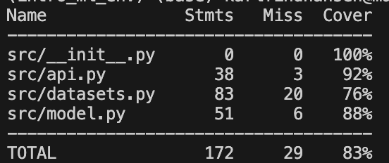
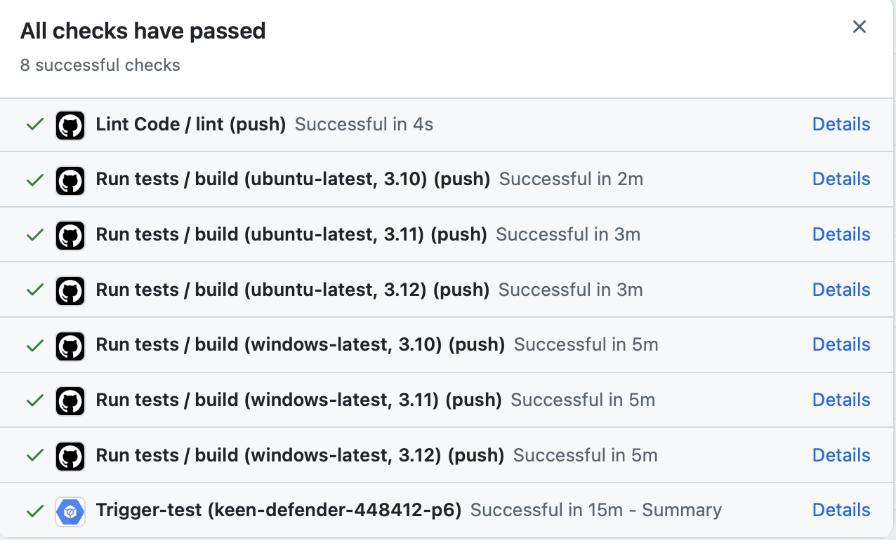
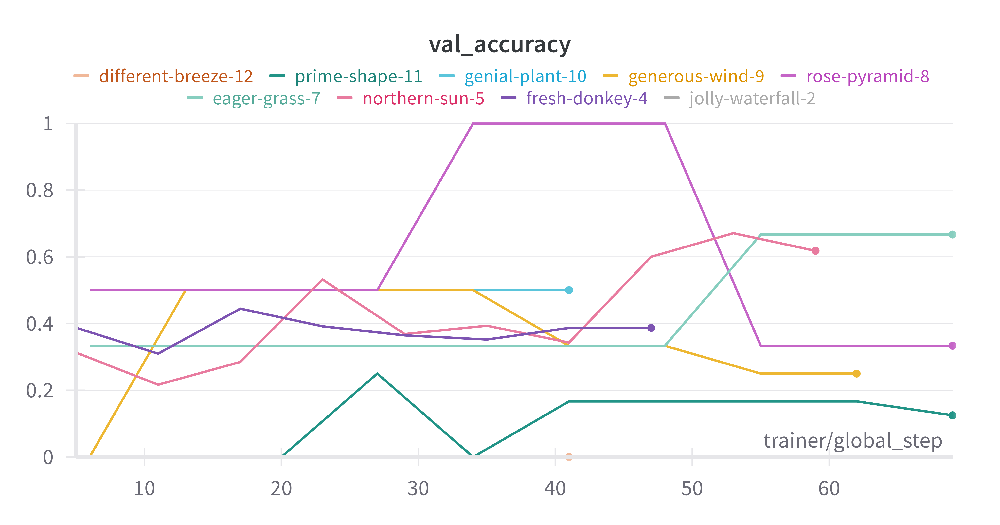
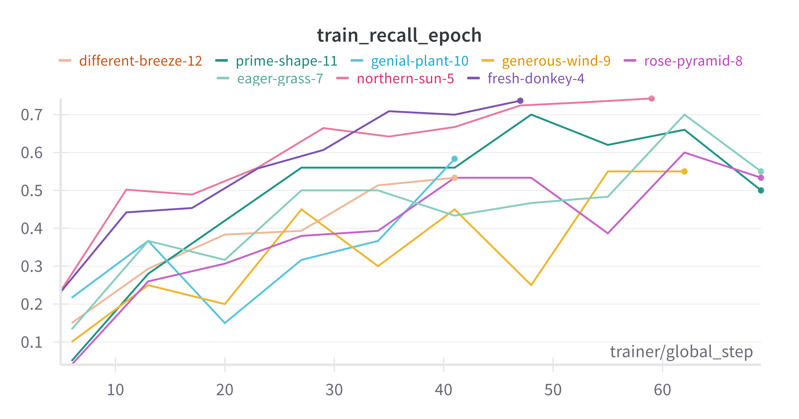
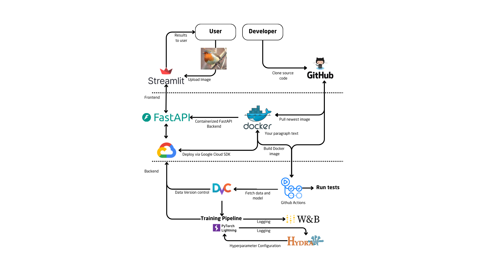

# Exam template for 02476 Machine Learning Operations

This is the report template for the exam. Please only remove the text formatted as with three dashes in front and behind
like:

```--- question 1 fill here ---```

Where you instead should add your answers. Any other changes may have unwanted consequences when your report is
auto-generated at the end of the course. For questions where you are asked to include images, start by adding the image
to the `figures` subfolder (please only use `.png`, `.jpg` or `.jpeg`) and then add the following code in your answer:

```markdown

```

In addition to this markdown file, we also provide the `report.py` script that provides two utility functions:

Running:

```bash
python report.py html
```

Will generate a `.html` page of your report. After the deadline for answering this template, we will auto-scrape
everything in this `reports` folder and then use this utility to generate a `.html` page that will be your serve
as your final hand-in.

Running

```bash
python report.py check
```

Will check your answers in this template against the constraints listed for each question e.g. is your answer too
short, too long, or have you included an image when asked. For both functions to work you mustn't rename anything.
The script has two dependencies that can be installed with

```bash
pip install typer markdown
```

## Overall project checklist

The checklist is *exhaustive* which means that it includes everything that you could do on the project included in the
curriculum in this course. Therefore, we do not expect at all that you have checked all boxes at the end of the project.
The parenthesis at the end indicates what module the bullet point is related to. Please be honest in your answers, we
will check the repositories and the code to verify your answers.

### Week 1

* [ ] Create a git repository (M5)
* [ ] Make sure that all team members have write access to the GitHub repository (M5)
* [ ] Create a dedicated environment for you project to keep track of your packages (M2)
* [ ] Create the initial file structure using cookiecutter with an appropriate template (M6)
* [ ] Fill out the `data.py` file such that it downloads whatever data you need and preprocesses it (if necessary) (M6)
* [ ] Add a model to `model.py` and a training procedure to `train.py` and get that running (M6)
* [ ] Remember to fill out the `requirements.txt` and `requirements_dev.txt` file with whatever dependencies that you
    are using (M2+M6)
* [ ] Remember to comply with good coding practices (`pep8`) while doing the project (M7)
* [ ] Do a bit of code typing and remember to document essential parts of your code (M7)
* [ ] Setup version control for your data or part of your data (M8)
* [ ] Add command line interfaces and project commands to your code where it makes sense (M9)
* [ ] Construct one or multiple docker files for your code (M10)
* [ ] Build the docker files locally and make sure they work as intended (M10)
* [ ] Write one or multiple configurations files for your experiments (M11)
* [ ] Used Hydra to load the configurations and manage your hyperparameters (M11)
* [ ] Use profiling to optimize your code (M12)
* [ ] Use logging to log important events in your code (M14)
* [ ] Use Weights & Biases to log training progress and other important metrics/artifacts in your code (M14)
* [ ] Consider running a hyperparameter optimization sweep (M14)
* [ ] Use PyTorch-lightning (if applicable) to reduce the amount of boilerplate in your code (M15)

### Week 2

* [ ] Write unit tests related to the data part of your code (M16)
* [ ] Write unit tests related to model construction and or model training (M16)
* [ ] Calculate the code coverage (M16)
* [ ] Get some continuous integration running on the GitHub repository (M17)
* [ ] Add caching and multi-os/python/pytorch testing to your continuous integration (M17)
* [ ] Add a linting step to your continuous integration (M17)
* [ ] Add pre-commit hooks to your version control setup (M18)
* [ ] Add a continues workflow that triggers when data changes (M19)
* [ ] Add a continues workflow that triggers when changes to the model registry is made (M19)
* [ ] Create a data storage in GCP Bucket for your data and link this with your data version control setup (M21)
* [ ] Create a trigger workflow for automatically building your docker images (M21)
* [ ] Get your model training in GCP using either the Engine or Vertex AI (M21)
* [ ] Create a FastAPI application that can do inference using your model (M22)
* [ ] Deploy your model in GCP using either Functions or Run as the backend (M23)
* [ ] Write API tests for your application and setup continues integration for these (M24)
* [ ] Load test your application (M24)
* [ ] Create a more specialized ML-deployment API using either ONNX or BentoML, or both (M25)
* [ ] Create a frontend for your API (M26)

### Week 3

* [ ] Check how robust your model is towards data drifting (M27)
* [ ] Deploy to the cloud a drift detection API (M27)
* [ ] Instrument your API with a couple of system metrics (M28)
* [ ] Setup cloud monitoring of your instrumented application (M28)
* [ ] Create one or more alert systems in GCP to alert you if your app is not behaving correctly (M28)
* [ ] If applicable, optimize the performance of your data loading using distributed data loading (M29)
* [ ] If applicable, optimize the performance of your training pipeline by using distributed training (M30)
* [ ] Play around with quantization, compilation and pruning for you trained models to increase inference speed (M31)

### Extra

* [ ] Write some documentation for your application (M32)
* [ ] Publish the documentation to GitHub Pages (M32)
* [ ] Revisit your initial project description. Did the project turn out as you wanted?
* [ ] Create an architectural diagram over your MLOps pipeline
* [ ] Make sure all group members have an understanding about all parts of the project
* [ ] Uploaded all your code to GitHub

## Group information

### Question 1
> **Enter the group number you signed up on <learn.inside.dtu.dk>**
>
> Answer:

23

### Question 2
> **Enter the study number for each member in the group**
>
> Example:
>
> *sXXXXXX, sXXXXXX, sXXXXXX*
>
> Answer:

s193624, s204748, s243345, s204674, s205336

### Question 3
> **A requirement to the project is that you include a third-party package not covered in the course. What framework**
> **did you choose to work with and did it help you complete the project?**
>
> Recommended answer length: 100-200 words.
>
> Example:
> *We used the third-party framework ... in our project. We used functionality ... and functionality ... from the*
> *package to do ... and ... in our project*.
>
> Answer:

We used the third-party framework `timm` in our project. The `create_model` function from this package allowed us to load a pretrained ResNet50 backbone, which we fine-tuned on our dataset for bird classification. Using a pretrained model helped us save time while improving performance, as the model had already learned features from a large dataset, providing a stronger starting point than training from scratch. This popular framework made it easy to work with state-of-the-art models like the one we chose and adapt it to our specific needs, greatly simplifying the process of setting up the model architecture.

## Coding environment

> In the following section we are interested in learning more about you local development environment. This includes
> how you managed dependencies, the structure of your code and how you managed code quality.

### Question 4

> **Explain how you managed dependencies in your project? Explain the process a new team member would have to go**
> **through to get an exact copy of your environment.**
>
> Recommended answer length: 100-200 words
>
> Example:
> *We used ... for managing our dependencies. The list of dependencies was auto-generated using ... . To get a*
> *complete copy of our development environment, one would have to run the following commands*
>
> Answer:

For python dependencies we use two key files: 
- **requirements.txt**: This file lists the promary dependencies required for the application to run. 
- **requirements_tests.txt**: This file includes additional dependencies for testing. 

We use Docker to manage dependencies for our APIs. Each API has it's own dockerfile, that specifies the neccesary base image, dependencies, and configurations to setup the runtime enviroment. 

To get a copy of the developments enviroment, you would: 
* Cloone the repository. 
* Build and run the docker container. 
* Or alternativly, to run the setup locally; set up a virtual enviroment, activate it anf insdtall the dependencies. 

By using this appraoch, we manage to ensure consistency and reproducibility. 

### Question 5

> **We expect that you initialized your project using the cookiecutter template. Explain the overall structure of your**
> **code. What did you fill out? Did you deviate from the template in some way?**
>
> Recommended answer length: 100-200 words
>
> Example:
> *From the cookiecutter template we have filled out the ... , ... and ... folder. We have removed the ... folder*
> *because we did not use any ... in our project. We have added an ... folder that contains ... for running our*
> *experiments.*
>
> Answer:

We unfortunately didn't use the cookiecutter template for our project. However we tried to follow the structure of the template as much as possible. The project structure can be seen in the README.md file in the repository. We have all the same files, except for the visualize.py file, which we didn't need. We also created new files for having an explanability element in the project and a part of our API front end, which is the explanation.py and frontend.py files in the src folder, this creates a saliency map for our frontend. We misnamed the evaluate.py file, and called it test.py file instead.

### Question 6

> **Did you implement any rules for code quality and format? What about typing and documentation? Additionally,**
> **explain with your own words why these concepts matters in larger projects.**
>
> Recommended answer length: 100-200 words.
>
> Example:
> *We used ... for linting and ... for formatting. We also used ... for typing and ... for documentation. These*
> *concepts are important in larger projects because ... . For example, typing ...*
>
> Answer:

We used the Ruff VSCode extension for linting and formatting, ensuring that our code followed consistent style and quality standards. Additionally, a GitHub workflow was set up to validate whether files pushed to the main branch adhered to Ruff formatting rules. If issues were detected, it provided clear suggestions for corrections. For typing, we implemented type annotations in certain files to improve code clarity and reliability, although this was not applied universally. As for documentation, while formal documentation practices were not established, we added comments in critical sections to explain complex logic and key functionalities.

These practices are crucial in larger projects for several reasons. Linting and formatting ensure a consistent codebase, making it easier for multiple contributors to read, understand, and modify the code without introducing unnecessary errors. Typing enhances code reliability by allowing static analysis tools to catch type-related bugs early. Documentation—whether formal or informal—provides essential context, which is especially valuable as projects grow in complexity.

## Version control

> In the following section we are interested in how version control was used in your project during development to
> corporate and increase the quality of your code.

### Question 7

> **How many tests did you implement and what are they testing in your code?**
>
> Recommended answer length: 50-100 words.
>
> Example:
> *In total we have implemented X tests. Primarily we are testing ... and ... as these the most critical parts of our*
> *application but also ... .*
>
> Answer:

We have implemented 11 distinct tests. We are testing the API using the /predict/ endpoint. We are testing the data, that we initialize the dataloader correctly, and that the dataloader returns the correct number of samples. We are testing that model, that it is correctly loaded, and that we can do a forward pass. We are also testing the metrics, output shape as well as the optimizer and scheduler. We didn't manage for test_api to work in the github actions, but it works locally.

### Question 8

> **What is the total code coverage (in percentage) of your code? If your code had a code coverage of 100% (or close**
> **to), would you still trust it to be error free? Explain you reasoning.**
>
> Recommended answer length: 100-200 words.
>
> Example:
> *The total code coverage of code is X%, which includes all our source code. We are far from 100% coverage of our **
> *code and even if we were then...*
>
> Answer:

When we omit the tests in the coverage report, we get a coverage of 83%, this not including code for the whole project but only code for the following files:



Many of the files in the repository are untouched from the testing, and the testing we do is fairly simple. Even if we had 100% code coverage, we would not trust our code to be error-free. Code coverage is a metric that indicates the percentage of code that is executed by tests. While high code coverage is a good indicator of test quality, it does not guarantee that the tests are good or that the code is free of errors.

### Question 9

> **Did you workflow include using branches and pull requests? If yes, explain how. If not, explain how branches and**
> **pull request can help improve version control.**
>
> Recommended answer length: 100-200 words.
>
> Example:
> *We made use of both branches and PRs in our project. In our group, each member had an branch that they worked on in*
> *addition to the main branch. To merge code we ...*
>
> Answer:

We made use of both branches and PR in our project. We had a branch for each separate feature or bug fix. When a team member finished working on their branch, they merged their changes to with main. If there were somethings that needed to be fixed or checked a team member would create a pull request, where the other team members could review the changes. Then we would either merge or close the pull request. This workflow helped us to keep the main branch clean and stable, as well as making sure that the code was reviewed by at least one other team member before being merged.

### Question 10

> **Did you use DVC for managing data in your project? If yes, then how did it improve your project to have version**
> **control of your data. If no, explain a case where it would be beneficial to have version control of your data.**
>
> Recommended answer length: 100-200 words.
>
> Example:
> *We did make use of DVC in the following way: ... . In the end it helped us in ... for controlling ... part of our*
> *pipeline*
>
> Answer:

Yes, we used DVC to manage the dataset efficiently. Specifically, we tracked our dataset (CUB-200-2011) with DVC and stored it in a Google Cloud Storage (GCS) bucket. By using DVC, we were able to version our dataset alongside the codebase. This allowed us to maintain reproducibility and avoided issues caused by outdated datasets. Also, it is considered a bad practice to store the dataset directly on GitHub, and keeping the dataset separate from it reduced the repository size substantially. Lastly, it simplified collaboration, as team members could pull the exact dataset version by simply running `dvc pull`, instead of having to download it manually from another source (e.g. Dropbox). So by using DVC, we improved reproducibility and prevented dataset management headaches.

### Question 11

> **Discuss you continuous integration setup. What kind of continuous integration are you running (unittesting,**
> **linting, etc.)? Do you test multiple operating systems, Python  version etc. Do you make use of caching? Feel free**
> **to insert a link to one of your GitHub actions workflow.**
>
> Recommended answer length: 200-300 words.
>
> Example:
> *We have organized our continuous integration into 3 separate files: one for doing ..., one for running ... testing*
> *and one for running ... . In particular for our ..., we used ... .An example of a triggered workflow can be seen*
> *here: <weblink>*
>
> Answer:

For our project we have set up contionous integration to ensure code quality. The continuous integration pipeline consists of unittesting, linting and cloudbuild. 
- Unittests:
    - We test all the unittests we have created to verify correctness of our code. The unittests that relates to api are not executed, as we haven’t managed to merge that fully with the GitHub. For all unittests we test on ubuntu and windows using 3 different versions of python.
        - Initially we wanted to test on macOS, but we encountered several memory constraints during training, and decided to skip it.
    - For linting, we only run it on ubuntu, we it installs ruff linter. Ruff helps us identify issues like unused imports, incorrect syntax, and style violations.
    - The cloudbuild plays an essential role in automating our deployment pipeline. It works by generating data using the fastai framework. After generating the nessasary data the cloudbuild proceeds to build a container in the cloud enviorment. This containerization ensures that our project and its dependencies are packaged and isolated, making the environment more reproducible and scalable. When the container is build, we push the container image to the cloud registry.

We don’t make use of caching, this is something we could do to optimise our workflow and make it faster.  



## Running code and tracking experiments

> In the following section we are interested in learning more about the experimental setup for running your code and
> especially the reproducibility of your experiments.

### Question 12

> **How did you configure experiments? Did you make use of config files? Explain with coding examples of how you would**
> **run a experiment.**
>
> Recommended answer length: 50-100 words.
>
> Example:
> *We used a simple argparser, that worked in the following way: Python  my_script.py --lr 1e-3 --batch_size 25*
>
> Answer:

We used Hydra for managing configurations. Hydra simplifies managing hyperparameters and experiment settings through .yaml config files.
To run an experiment: 
```bash 
python train.py hyperparameters
```

### Question 13

> **Reproducibility of experiments are important. Related to the last question, how did you secure that no information**
> **is lost when running experiments and that your experiments are reproducible?**
>
> Recommended answer length: 100-200 words.
>
> Example:
> *We made use of config files. Whenever an experiment is run the following happens: ... . To reproduce an experiment*
> *one would have to do ...*
>
> Answer:

We ensured the reproducibility of experiments by using Hydra for configuration management and and Weights & Biases (W&B) for logging experiment metadata and results.

When an experiment is run, the following happens: 
- Hydra dynamically manages hyperparameters and settings through the YAML config files.
- W&B automatically logs experiment results, including metrics, configuration parameters, and training progress. Each experiment is assigned a unique run ID for tracking. 

### Question 14

> **Upload 1 to 3 screenshots that show the experiments that you have done in W&B (or another experiment tracking**
> **service of your choice). This may include loss graphs, logged images, hyperparameter sweeps etc. You can take**
> **inspiration from [this figure](figures/wandb.png). Explain what metrics you are tracking and why they are**
> **important.**
>
> Recommended answer length: 200-300 words + 1 to 3 screenshots.
>
> Example:
> *As seen in the first image when have tracked ... and ... which both inform us about ... in our experiments.*
> *As seen in the second image we are also tracking ... and ...*
>
> Answer:

As seen in image below we have tracked the validation accuracy. The validation accuracy, informs how well the model is able to generalize to unseen examples during training time. This metric is calculated using a separate validation dataset, distinct from the training dataset, which simulates real-world examples the model has not encountered before. It is an important metric to monitor as it can reveal if the model under- or overfits or plateaueing. 
We want to see an increasing validation accuracy. This means the model performance is improving. A model with high validation accuracy is likely to perform better on unseen test data, indicating good generalization
If the validation remains consistently low, it may indicate underfitting. This happens when the model is too simple to capture the underlying patterns in the data. 
If there is a large difference between training and validtaion accuracy, it indicates overfitting. In this case the mdoel can predict training samples very well, but is unable to generalise to the new data instances. 


We also tracked trainig recall over epochs. Recall measures the models ability to correctly identify all relevant positive instances in the training dataset. In a multiclass scenario, like ours, recall is calculates for each class and than aggragated. 
This metric, concerns only predictions in the training, it tells us if the model is improving over the training epochs. It is a good metric to monitor, as we want to make sure that performance is improving; this would mean recall is increasing.
If recall is decrerasing it could indicate overfitting or a poor learning rate. If the recall plateaues, it could mean, the mdoel has learned all that it can from the training data. 



### Question 15

> **Docker is an important tool for creating containerized applications. Explain how you used docker in your**
> **experiments/project? Include how you would run your docker images and include a link to one of your docker files.**
>
> Recommended answer length: 100-200 words.
>
> Example:
> *For our project we developed several images: one for training, inference and deployment. For example to run the*
> *training docker image: `docker run trainer:latest lr=1e-3 batch_size=64`. Link to docker file: <weblink>*
>
> Answer:
For our project, we developed several Docker images. Our Project includes images for API, training and Weight and Biases.

**Training image**:  This container is used for model training. The Dockerfile installs essential libraries, copies the source code and data, and sets the working directory for training execution. For example, to run the training container:

```bash
docker run trainer:latest lr=1e-3 batch_size=64
```

**API image**:  The API container is used for eploying the FastAPI backend, which acts as an inference gateway in out project. The Dockerfile sets up the FastAPI application, including installing dependencies and configuring the uvicorn server. To run the API container:
```bash
docker run -p 8000:8000 api:latest
```

**WandB image**: The WandB container is dedicated to testing and integrating with Weights & Biases for logging metrics, tracking experiments and parameter sweeps. The Dockerfile sets up the W&B logging environment, including dependencies and configurations, and executes the wandb_tester.py script to validate logging workflows. To run the W&B container:

```bash
docker run wandb:latest
```

Here is a link to the training dockerfile: <https://github.com/karlfindhansen/MLOps_Jan2025/blob/main/dockerfiles/train.dockerfile>*. 

### Question 16

> **When running into bugs while trying to run your experiments, how did you perform debugging? Additionally, did you**
> **try to profile your code or do you think it is already perfect?**
>
> Recommended answer length: 100-200 words.
>
> Example:
> *Debugging method was dependent on group member. Some just used ... and others used ... . We did a single profiling*
> *run of our main code at some point that showed ...*
>
> Answer:

When debugging, we primarily relied on print statements and error messages to identify issues in the code. For more complex issues involving many scripts and variables we also used the python debugger when printing made it too difficult. Additionally, we used torch.profiler to see our potential bottlenecks. The largest bottlenecks were in the data loading and model training phases. Profiling revealed that data preprocessing and loading from disk were taking a significant amount of the time, especially when the dataset was large. While this posed opportunities to optimize the dataloader we chose to focus on other things instead. While this would have been a great learning opportunity, optimization issues weren’t a problem in our small project, which is why we decided to move on to thing more important to this particular project.

## Working in the cloud

> In the following section we would like to know more about your experience when developing in the cloud.

### Question 17

> **List all the GCP services that you made use of in your project and shortly explain what each service does?**
>
> Recommended answer length: 50-200 words.
>
> Example:
> *We used the following two services: Engine and Bucket. Engine is used for... and Bucket is used for...*
>
> Answer:

1. Compute
		Google Cloud's Compute service is used to obtain computing resources to run applications, including virtual machines (VMs) 		which we use to train out model and containers which we used to run our app.
2. Storage
		Google Cloud's Storage service offers scalable and secure storage and we used this for our training data, as well as storing 		our trained model and docker images.
3. AI/ML
		Google Cloud's AI/ML services are tools for building and deploying machine learning models. We used this service with vertex 		AI which we use to both train and deploy our for model to the buckets.


### Question 18

> **The backbone of GCP is the Compute engine. Explained how you made use of this service and what type of VMs**
> **you used?**
>
> Recommended answer length: 100-200 words.
>
> Example:
> *We used the compute engine to run our ... . We used instances with the following hardware: ... and we started the*
> *using a custom container: ...*
>
> Answer:

In this project, we used Vertex AI from Google Cloud to train our model. Compute Engine is the part of Google Cloud that helps us run virtual machines (VMs). Even though our model and dataset are small, Vertex AI automatically takes care of creating and managing the VMs for us. The VMs used were mainly CPU instances, which we chose to save on ressources and money and because of the simple model and dataset, this was sufficient. This setup lets us focus on training the model, while Vertex AI handles everything behind the scenes, like choosing and managing the VMs. This made the training process easier and faster without needing to manually set up or monitor the VMs.


### Question 19

> **Insert 1-2 images of your GCP bucket, such that we can see what data you have stored in it.**
> **You can take inspiration from [this figure](figures/bucket.png).**
>
> Answer:

[image of buceket](reports/figures/Buckets_overview.png).**

### Question 20

> **Upload 1-2 images of your GCP artifact registry, such that we can see the different docker images that you have**
> **stored. You can take inspiration from [this figure](figures/registry.png).**
>
> Answer:

[image of artifact registry](reports/figures/artifact_register.png).**

### Question 21

> **Upload 1-2 images of your GCP cloud build history, so we can see the history of the images that have been build in**
> **your project. You can take inspiration from [this figure](figures/build.png).**
>
> Answer:

[image of Cloud build history](reports/reports/figures/Cloud_build_history.png).**


### Question 22

> **Did you manage to train your model in the cloud using either the Engine or Vertex AI? If yes, explain how you did**
> **it. If not, describe why.**
>
> Recommended answer length: 100-200 words.
>
> Example:
> *We managed to train our model in the cloud using the Engine. We did this by ... . The reason we choose the Engine*
> *was because ...*
>
> Answer:

We used Vertex AI to train the model in the cloud to make the training simpler and to avoid managing the VM. We did this by first we set up the training proces to run locally while using the dataset we uploaded to the google cloud bucket. Modified the code to save the model to our model bucket after training. After confirming the process run worked locally, we built a docker image with the training process as entrypoint and uploaded this to the google artifact registry. Then we created a config file to specify some parameters and the docker image to be used. Then we can the whole process with vertex ai which spun up a VM to run it, by typing a command like:
gcloud ai custom-jobs create \
  --region=us-central1 \
  --display-name=your-job-name \
  --python-package-uris=gs://your-bucket-id/path/to/package.tar.gz \
  --python-module=your_training_script.train \
  --worker-pool-spec=machine-type=n1-standard-4,replica-count=1,python-package=your-package-uri

## Deployment

### Question 23

> **Did you manage to write an API for your model? If yes, explain how you did it and if you did anything special. If**
> **not, explain how you would do it.**
>
> Recommended answer length: 100-200 words.
>
> Example:
> *We did manage to write an API for our model. We used FastAPI to do this. We did this by ... . We also added ...*
> *to the API to make it more ...*
>
> Answer:

We managed to write an API for our model, we used FastAPI to do it. We had some problems locating the blob and bucket in google cloud storage, once this got fixed we made a prediction function in the backend.py file, that takes an image, which we upload through the frontend. Then it uses the model, which is trained on the cloud to make a prediction and a saliency map of the image. For us to be able to do this, we had to set up the local google cloud enviornment on our computers and make a local variable with the bucket, this allowed us to access and connect to google cloud.

### Question 24

> **Did you manage to deploy your API, either in locally or cloud? If not, describe why. If yes, describe how and**
> **preferably how you invoke your deployed service?**
>
> Recommended answer length: 100-200 words.
>
> Example:
> *For deployment we wrapped our model into application using ... . We first tried locally serving the model, which*
> *worked. Afterwards we deployed it in the cloud, using ... . To invoke the service an user would call*
> *`curl -X POST -F "file=@file.json"<weburl>`*
>
> Answer:

--- question 24 fill here ---

### Question 25

> **Did you perform any unit testing and load testing of your API? If yes, explain how you did it and what results for**
> **the load testing did you get. If not, explain how you would do it.**
>
> Recommended answer length: 100-200 words.
>
> Example:
> *For unit testing we used ... and for load testing we used ... . The results of the load testing showed that ...*
> *before the service crashed.*
>
> Answer:

We performed unit testing on the image prediction endpoint using the FastAPI. Specifically the tests are interested in ensuring that the API can handle and return predictions for images.

In the API test we test for:
- We check whether the specified directory contains images.
- We verify that the image files are present in the directory.
- Then we send an image to the /predict/ endpoint in the fastapi application.
- Then we verify that the api responds with a prediction for the image. It doesn’t need to be the correct prediction, we simply need to get a response from the API.

### Question 26

> **Did you manage to implement monitoring of your deployed model? If yes, explain how it works. If not, explain how**
> **monitoring would help the longevity of your application.**
>
> Recommended answer length: 100-200 words.
>
> Example:
> *We did not manage to implement monitoring. We would like to have monitoring implemented such that over time we could*
> *measure ... and ... that would inform us about this ... behaviour of our application.*
>
> Answer:

We did not manage to implement monitoring in our project. However, monitoring would help the longevity of our application. Using monitoring we could track the performance of the application. This would help identify any drift in the model's predictions caused by changes in data distribution over time. Additionally, monitoring could detect failures or anomalies in the backend, such as slow responses or failed API calls. 

Using monitoring, we could set up alerts, to notify us when something goes wrong. This would help us maintain a robust and reliable model. Maybe at somepoint it would be beneficial to retrain the model becauese of changes in data ditrubution - using monitoring we could set up alerts to inform us about this. 

## Overall discussion of project

> In the following section we would like you to think about the general structure of your project.


### Question 27

> **How many credits did you end up using during the project and what service was most expensive? In general what do**
> **you think about working in the cloud?**
>
> Recommended answer length: 100-200 words.
>
> Example:
> *Group member 1 used ..., Group member 2 used ..., in total ... credits was spend during development. The service*
> *costing the most was ... due to ... . Working in the cloud was ...*
>
> Answer:

In the project we used a total of $2.32 credits. The most expensive service by a large margin was Container Registry Vulnerability Scanning, costing $1.82 probably due to the fact that this service was used the most. These scans have higher costs on the size and number of images being analyzed and we have some fairly large and multiple images. Overall, working in the cloud was fairly easy and efficient and flexible, but not fit for a project of this size. For larger project the real benefits will show.


### Question 28

> **Did you implement anything extra in your project that is not covered by other questions? Maybe you implemented**
> **a frontend for your API, use extra version control features, a drift detection service, a kubernetes cluster etc.**
> **If yes, explain what you did and why.**
>
> Recommended answer length: 0-200 words.
>
> Example:
> *We implemented a frontend for our API. We did this because we wanted to show the user ... . The frontend was*
> *implemented using ...*
>
> Answer:

We implemented a frontend for our API using Streamlit. This allowed us to provide an intuitive and interactive interface where users could upload images, view model predictions, and evaluate results without needing to interact directly with the backend code. We also implemented a saliency map computation so that the user can see the most relevant parts of the image for the class prediction. The frontend made our project more accessible to non-technical users, improving usability and demonstrating the functionality of our bird classification model effectively.

Additionally, we enabled distributed data loading by incorporating parameters `DistributedSampler` and `num_workers` into our DataLoader functions for efficient usage across multiple GPUs or nodes. For model training, we also included parameters support for distributed strategies like Distributed Data Parallel (DDP).

### Question 29

> **Include a figure that describes the overall architecture of your system and what services that you make use of.**
> **You can take inspiration from [this figure](figures/overview.png). Additionally, in your own words, explain the**
> **overall steps in figure.**
>
> Recommended answer length: 200-400 words
>
> Example:
>
> *The starting point of the diagram is our local setup, where we integrated ... and ... and ... into our code.*
> *Whenever we commit code and push to GitHub, it auto triggers ... and ... . From there the diagram shows ...*
>
> Answer:



The diagram illustrates the project in three tiers: 

**At the first level, a user or developer interacts with the system.**

- A user will use the system by uploading an image an interactive interface. In this way the user interacts with our frontend application which is developed with Streamlit. 
- A developer can interact with the project by cloning the source code on GitHub. 

**The second level illustrates the frontend tool.**

- When a user uploads an image, Streamlit communicates with FastAPI, which acts as a gateway to the backend. The image is processed, and FastAPI returns the result (bird species prediction) to the user through the interface. 
- To make the predictions FastAPI fetches a pre-trained model (fine-tuned ResNet) hosted in the backend, to classify the uploaded image
- For developers, when the system is running, the newest Docker image is pulled to ensure the latest backend version is used. All dependencies required by FastAPI are encapsulated within the Docker container, ensuring portability and consistency.
- FastAPI connects to Google Cloud to fetch the model for classification. 
- Google Cloud SDK is used to push the Docker container to the cloud. 

**The third level illustrates the backend**

- The backend contains a training pipeline, witch is optimized with Pytorch Lightning. 

- The training process is logged using WeightAndBiases and Hydra. 

- The training pipeline fecthes data from DVC. 

- The trained model is saved in Google Cloud. 

- We also integrated several tests; testing both the training process and data loading in GitHub Actions.

- When a developer commits changed to the repository a GitHub Actions workflow is triggered.

- For the tests to run, Github Actions fetches the model and data using DVC. 


### Question 30

> **Discuss the overall struggles of the project. Where did you spend most time and what did you do to overcome these**
> **challenges?**
>
> Recommended answer length: 200-400 words.
>
> Example:
> *The biggest challenges in the project was using ... tool to do ... . The reason for this was ...*
>
> Answer:

--- question 30 fill here ---

### Question 31

> **State the individual contributions of each team member. This is required information from DTU, because we need to**
> **make sure all members contributed actively to the project. Additionally, state if/how you have used generative AI tools in your project.**
>
> Recommended answer length: 50-300 words.
>
> Example:
> *Student sXXXXXX was in charge of developing of setting up the initial cookie cutter project and developing of the docker containers for training our applications.*
> *Student sXXXXXX was in charge of training our models in the cloud and deploying them afterwards.*
> *All members contributed to code by...*
> *We have used ChatGPT to help debug our code. Additionally, we used GitHub Copilot to help write some of our code.*
> Answer:

- Student s243345 contributed by implementing a linting workflow, adding explainability with saliency maps, setting up wandb sweeps for hyperparameter optimization, integrating Hydra with wandb and Pytorch Lightning, and establishing DVC with a GCP Bucket.
- Student sXXXXXX contributed by...
- All members contributed to code by...

We have used ChatGPT to assist in debugging our code, resolving specific issues, and clarifying concepts related to our implementation. We also used this AI tool to refine the wording of some parts of this report.